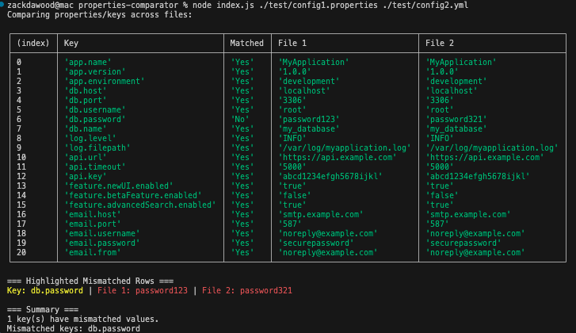
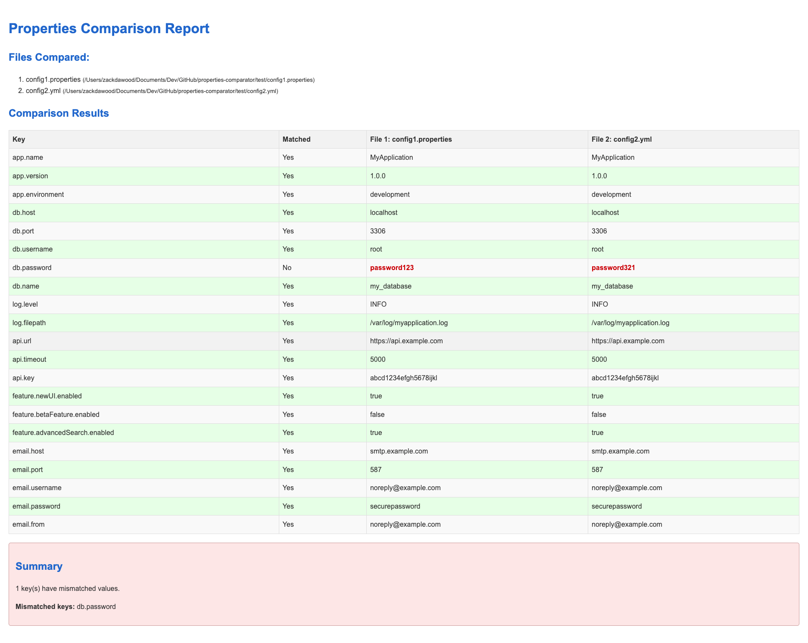

# properties-comparator
This utility provides functionality to parse and compare **.properties** and **.yml or .yaml(YAML)** files in the format of key-value pairs. It reads these files, compares the values for each key across multiple files, and logs the results.


Utility is available as NPM Package [https://www.npmjs.com/package/properties-comparator](https://www.npmjs.com/package/properties-comparator)


###  Install the Package
`npm install -g properties-comparator`


## Now you can run the script globally using:

```properties-comparator <filePath1> <filePath2>```


## HTML Report 
``` properties-comparator--format html --output report.html file1.properties file2.yaml ```

## Markdown Report 
``` properties-comparator -f markdown -o report.md file1.properties file2.yaml ```


## Compiled on npm@11.1.0 & node v22.13.0
`npm install -g npm@11.1.0`

### Check [Documentation](DOCUMENTATION.md) for more details

## Terminal View




## HTML View



## Markdown View


## Well Tested with 90+% code coverage


