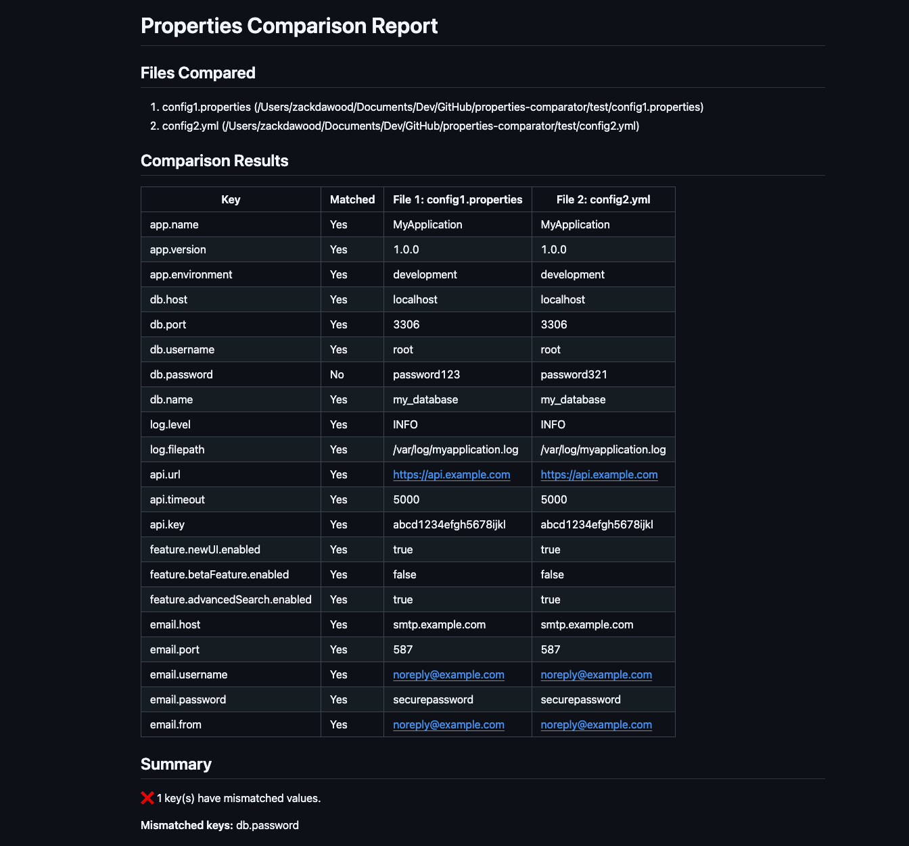
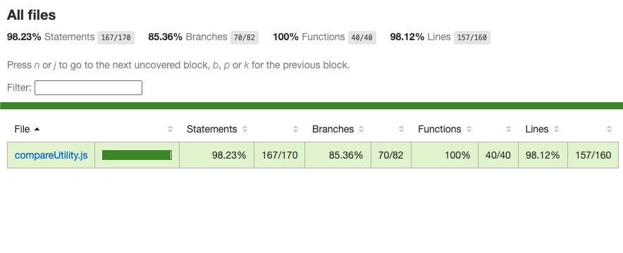

# properties-comparator

A powerful utility for parsing and comparing **.properties** and **.yml/.yaml** files. This tool reads files as key-value pairs, compares values across multiple files, and generates detailed comparison reports in various formats.

[](https://www.npmjs.com/package/properties-comparator)  [](https://sonarcloud.io/summary/new_code?id=zackria_properties-comparator) 

## Features

- **Multi-format Support**: Parse both **.properties** files and **.yml/.yaml** (YAML) files
- **Nested Structure Handling**: Flatten nested YAML structures into key-value pairs
- **Comprehensive Comparison**: Compare values across multiple files simultaneously
- **Multiple Report Formats**:
  - Console output with color-coded highlighting
  - HTML reports with CSS styling
  - Markdown reports
- **Flexible Output Options**: Save reports to files or display in console
- **User-friendly CLI**: Simple command-line interface with intuitive options

## Installation

```bash
# Install globally
npm install -g properties-comparator

# To uninstall
npm uninstall -g properties-comparator
```

## Usage

### Basic Usage

Compare two or more files:

```bash
properties-comparator <filePath1> <filePath2> [<filePath3> ...]
```

### Examples

Compare multiple files:
```bash
properties-comparator ./config1.properties ./config2.yml ./config3.properties
```

Generate HTML report:
```bash
properties-comparator -f html -o report.html ./config1.properties ./config2.yml
```

Generate Markdown report:
```bash
properties-comparator -f markdown -o report.md ./config1.properties ./config2.yml
```

### Command Options

- `-f, --format <type>` - Report format (console, html, markdown)
- `-o, --output <file>` - Output file for the report
- `-h, --help` - Display help information

## Report Examples

### Terminal View


### HTML View


### Markdown View


## Quality Assurance

This package is thoroughly tested with over 90% code coverage to ensure reliability.



## Compatibility

Developed and tested with:
- npm v11.7.0
- Node.js v25.2.1

## Documentation

For more detailed information, please check the [Documentation](DOCUMENTATION.md).

## License

[MIT](LICENSE)
